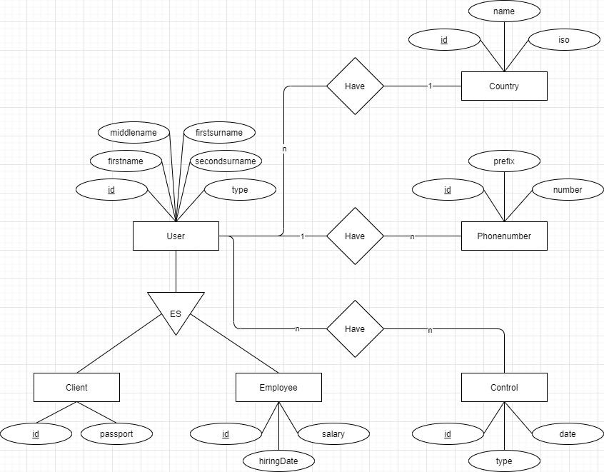
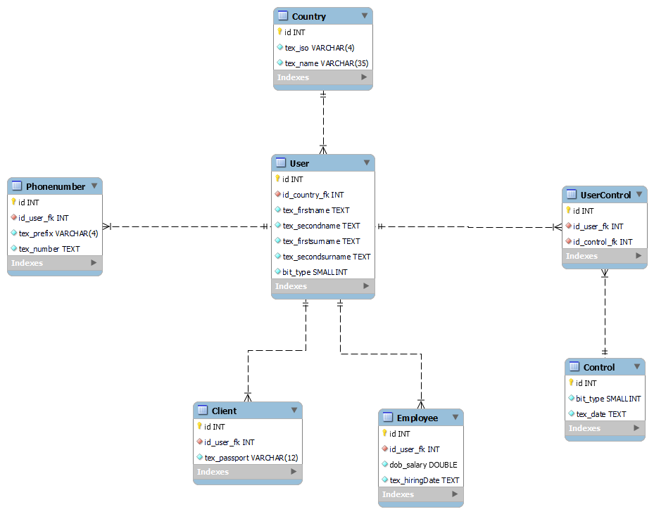
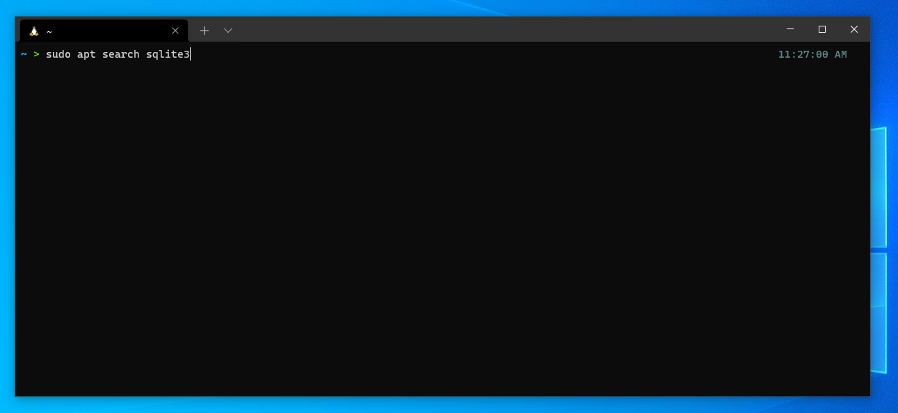
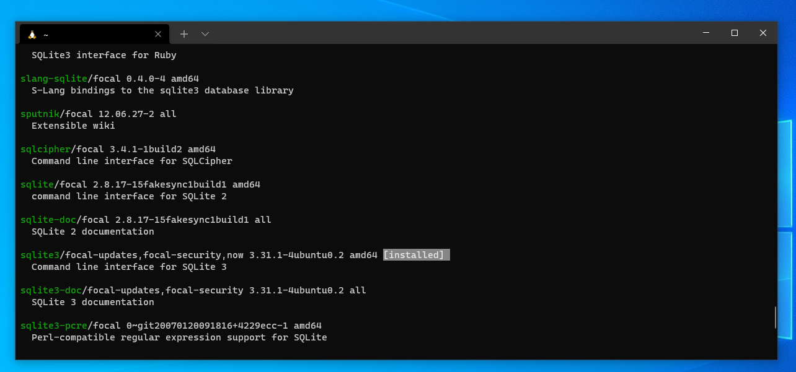
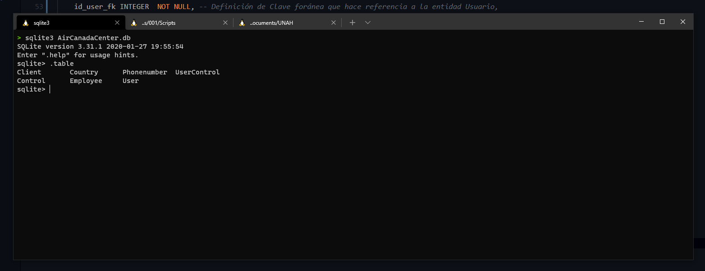

```
    @author kenneth.cruz@unah.hn
    @version 0.1.0
    @date 2021/05/22
```

# Repaso 

Crear aplicación para dar solución a la problemática presentada por el maestro utilizando SQLITE, se presentará código, diagrama relacional, ejecutable (Archivo.Exe) y pequeño Instructivo. cualquier otro formato se considerara como **NO PRESENTADO**.

Se defenderá frente a toda la clase.

## Definicion del Ejercicio 

El aeropuerto *Air Canadá Center*, desea llevar un control sobre las personas que entran y salen de sus puertas para lo que requiere realizar un control.

Este control tomara los datos de las personas una tan sola vez luego a la persona se la dará un Id que ingresara en la puerta para poder abrir la puerta y salir o entrar según lo necesite.

De las personas se desea guardar la información general como ser Identificación que siempre será el numero de pasaporte que consta de 12 caracteres, los cuales pueden ser letras o números, seguidamente el nombre completo que serian dos nombres y dos apellidos, así como también el país de origen. Luego una lista de teléfonos que pueden ser de diferentes países por los cual se requiere identificar el área de cada teléfono.

El control de entradas y salida se guardará de la siguiente forma, Persona, Actividad que puede ser entrar o salir y la fecha y hora de la actividad.

Cabe mencionar que a cada persona se le identificara si es empleado o no del Aeropuerto. 

## Identificación de las reglas de negocio

### Se listan:
- Control de personas que entran y salen del aeropuerto
- Para el registro de las personas, se hará una sola vez, a partir de aquí se le dará un identificador único que ingresará cada vez que este pase por las puertas (sea que salga o entre al aeropuerto)
- **De las personas** se dea guardar: 
  - Número de pasaporte (consta de 12 carácteres alfanuméricos  )
  - Nombre completo (2 nombres, 2 apellidos)
  - País de origen
  - Tipo de persona (Empleado o cliente de la aerolínea)
  - Lista de número de teléfonos (pueden ser varios)
    - guardar el número de área o zona
- **Control de entrada/salida**
  - Actividad que realiza la persona (Entrada o salida)
  - Fechay hora de la actividad

### Atributos y entidades

**Entidades identificadas**
- Cliente
- Empleado
- Control de entrada y salida


## Diagrama ER 

Se utiliza la nomenclatura de Peter Chen para la realización del diagrama Entidad-Relación:



## Diagrama Relacional 




## Configuración de entorno: WSL + SQLite3

WSL (Windows Subsystem for Linux) es una virtualización nativa de Ubuntu para Windows 10, funciona como máquina virtual optimizada, con la salvedad que utiliza el minímo de recursos y viene con algunas configuraciones por defecto (python, git, net-tools...).  
  
Podemos utilizar WSL como una máquina virtual instalando programas de distinta índole (MySQL, MariaDB, Python...) sin afectar el sistema de archivos de Windows. Es decir, se puede ejecutar scripts de Python desde WSL sin la necesidad de instalar Python en Windows.

### instalar SQLlite en WSL (equivalente para Debian-Ubuntu)

**Buscamos el paquetes sqlite3**:

```Shell
$ sudo apt search sqlite3
```


Para este caso, el paquete `sqlite3` ya está instalado.



<br>

**De no tener el paquete instalado en el sistema**:

```Shell
$ sudo apt install sqlite3
```

<br>

Una vez instalado, para realizar el equivalente a `CREATE DATABASE nameDB;` en SQLite debe crear un archivo con extensión *.db*, utilizando las bondades de Linux, creamos un archivo con el comando `touch filename.extension`

```Shell
$ touch nameDB.db
```

<br>

Para ejecutar los statements (la definición o manipulación) en su base de datos lo puede hacer desde el CLI o puede crear un archivo con extensión `.sql` y ejecutar estos statements directamente en su base de datos. 

para este ejemplo se ha utilizado dos archivos:
- dds_airCanadaCenter.sql 
- dms_airCanadaCenter.sql 

Uno con los statements correspondiente a la definición de la base de datos y uno correspondiente a los statements de inserción de datos.  

Se aprovecha las virtudes de la shell de linux y se utiliza un operador de control de flujo (`<`). 

```Shell
$ sqlite3 databasefile.db < PATH/statements.sql
```

Para ejecutar los statements sobre la base de datos de SQLite.  

<br>

Se ilustra en la siguienta imagen utilizando los archivo (statments) de prueba: 


<br>

El equivalente de `USE nameDB;` en SQLite para utilizar la base de datos es: 

```Shell
$ sqlite3 nameDB.db
```

Para nuestro caso de ejemplo:


<br>

El CLI en SQLite tiene la siguiente forma: 



<b>

Se utiliza `.table` para visualizar las entidades dentro de la base de datos.  
Una vez hecho esto, podemos utilizar cualquier cláusula permitida dentro del estándar SQL para visualizar datos dentro de la base de datos.


```SQL
SELECT * FROM User;
```

<br>

Para salir del CLI de SQLite usamos `.exit`.

